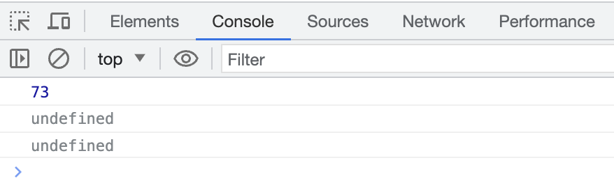
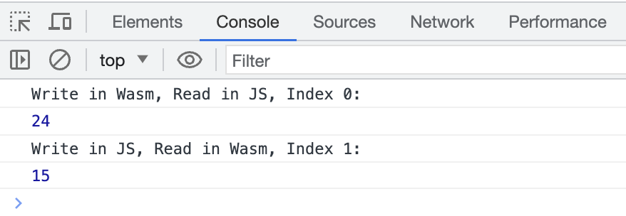
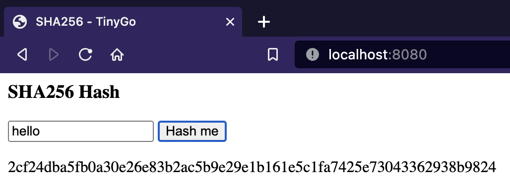

# WASM, Let's Go!

WebAssembly (abbreviated Wasm) is a safe, portable, low-level code format designed for efficient execution and compact
representation. Its main goal is to enable high performance applications on the Web, but it does not make any
Web-specific assumptions or provide Web-specific features, so it can be employed in other environments as well.

## Design Goals

Fast, safe, and portable semantics:

- __Fast__: executes with near native code performance, taking advantage of capabilities common to all contemporary
  hardware.
- __Safe__: code is validated and executes in a memory-safe, sandboxed environment preventing data corruption or
  security breaches.
- __Well-defined__: fully and precisely defines valid programs and their behavior in a way that is easy to reason about
  informally and formally.
- __Hardware-independent__: can be compiled on all modern architectures, desktop or mobile devices and embedded systems
  alike.
- __Language-independent__: does not privilege any particular language, programming model, or object model.
- __Platform-independent__: can be embedded in browsers, run as a stand-alone VM, or integrated in other environments.
- __Open__: programs can interoperate with their environment in a simple and universal manner.
- __Compact__: has a binary format that is fast to transmit by being smaller than typical text or native code formats.
- __Modular__: programs can be split up in smaller parts that can be transmitted cached and consumed separately.
- __Efficient__: can be decoded, validated, and compiled in a fast single pass, equally with either just-in-time (JIT)
  or ahead-of-time (AOT) compilation.
- __Streamable__: allows decoding, validation, and compilation to begin as soon as possible, before all data has been
  seen.
- __Parallelization__: allows decoding, validation, and compilation to be split into many independent parallel tasks.
- __Portable__: makes no architectural assumptions that are not broadly supported across modern hardware.

## Examples

Go to [examples](./examples) folder and run `./run.sh` with directory name to run an example.

For example:

```bash
./run.sh 1_hello_world
```

### 1. Hello World

Writing a simple `add` function and call it from JavaScript.

<div align="center">
    
</div>

### 2. Export

Using JavaScript to call a functon exported from WASM.

<div align="center">
    
</div>

### 3. Linear Memory

Using byte (Unsigned 8-bit integer) buffers and pointers (Wasm memory array indexes) as a way to pass memory back and
forth.

1. Writing in WASM, reading in JavaScript.
2. Writing in JavaScript, reading in WASM.

<div align="center">
    
</div>

### 4. String Manipulation

Taking the input string from JavaScript, and logging the value from WASM.

<div align="center">
    
</div>

### 5. SHA256

Taking the input string from JavaScript, and computing the SHA256 hash from WASM.

<div align="center">
    
</div>

## Useful Links

